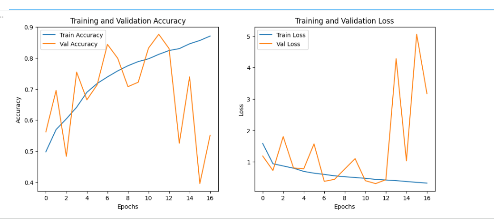
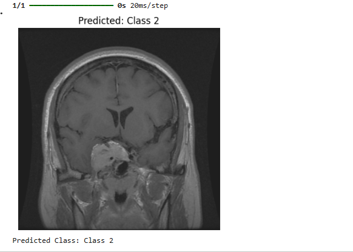

# 🧠 Brain MRI Tumor Classification using Custom CNN

<p align="center">


</p>

---

## 📌 Overview

This project implements a **Custom Convolutional Neural Network (CNN)** for **Brain MRI Tumor Classification** using TensorFlow and Keras.

The model classifies MRI scans into three tumor categories:

- Glioma
- Meningioma
- Pituitary Tumor

The project demonstrates an end-to-end deep learning workflow including preprocessing, data augmentation, model training, evaluation, visualization, and prediction.

> **Note:** This repository is intended for educational and research purposes and is **not** a clinical diagnostic system.

---

# ✨ Features

- Custom CNN architecture
- TensorFlow/Keras implementation
- MRI image preprocessing
- Data augmentation
- Batch Normalization & Dropout
- Multi-class classification
- Training & validation visualization
- Prediction pipeline
- Well-documented project structure

---

# 🏗️ Project Structure

```text
brain-tumor-mri-classification-cnn/
├── README.md
├── LICENSE
├── requirements.txt
├── .gitignore
├── CONTRIBUTING.md
├── notebooks/
│   └── Brain_Tumor_Classification.ipynb
├── assets/
│   ├── Training_Accuracy_loss.png
│   └── Prediction_result.png
├── docs/
├── model/
├── sample_images/
├── results/
└── src/
```

---

# 🧩 Model Architecture

```text
Input (224×224×3)
      │
Conv2D → BatchNorm → MaxPool
      │
Conv2D → BatchNorm → MaxPool
      │
Conv2D → BatchNorm → MaxPool
      │
Conv2D → BatchNorm → MaxPool
      │
Conv2D → BatchNorm → MaxPool
      │
Flatten
      │
Dense (1024)
      │
Dropout
      │
Dense (512)
      │
Dropout
      │
Softmax (3 Classes)
```

---

# 📂 Dataset

- **Source:** Kaggle Brain Tumor MRI Dataset
- Training Images: **18,398**
- Validation Images: **828**
- Classes:
  - Glioma
  - Meningioma
  - Pituitary Tumor

The dataset is **not included** because of its size and licensing.

---

# 🛠️ Technologies

- Python
- TensorFlow
- Keras
- NumPy
- Pandas
- OpenCV
- Matplotlib
- Scikit-learn
- Jupyter Notebook

---

# 🚀 Installation

```bash
git clone https://github.com/Khansa-Zahid/brain-tumor-mri-classification-cnn.git
cd brain-tumor-mri-classification-cnn
pip install -r requirements.txt
```

---

# ▶️ Usage

Open the notebook:

```bash
jupyter notebook
```

Run all cells in:

```text
notebooks/Brain_Tumor_Classification.ipynb
```

---

# 📈 Results

The repository includes:

- Training accuracy and loss curves
- Prediction examples
- Learning progress visualization

Since this repository focuses on reproducibility, exact performance metrics are intentionally omitted. Future updates will include confusion matrices, precision, recall, F1-score, and test-set evaluation.

---

# 📷 Screenshots

Add these images to the `assets` folder and uncomment if available:

```markdown



```

---

# 🔮 Future Improvements

- Transfer Learning (EfficientNet/ResNet)
- Grad-CAM visualization
- Streamlit deployment
- FastAPI REST API
- Docker support
- Hyperparameter tuning
- Explainable AI (XAI)

---

# 🤝 Contributing

Contributions are welcome!

1. Fork the repository.
2. Create a feature branch.
3. Commit your changes.
4. Open a Pull Request.

See `CONTRIBUTING.md` for details.

---

# ⚠️ Disclaimer

This project is intended for educational and research purposes only. It should **not** be used as a substitute for professional medical diagnosis.

---

# 👩‍💻 Author

**Khansa Zahid**

- Flutter Developer
- AI & Machine Learning Enthusiast
- Python Developer

---

# 📄 License

This project is licensed under the MIT License.

---

⭐ If you found this project useful, consider giving it a **Star**.

